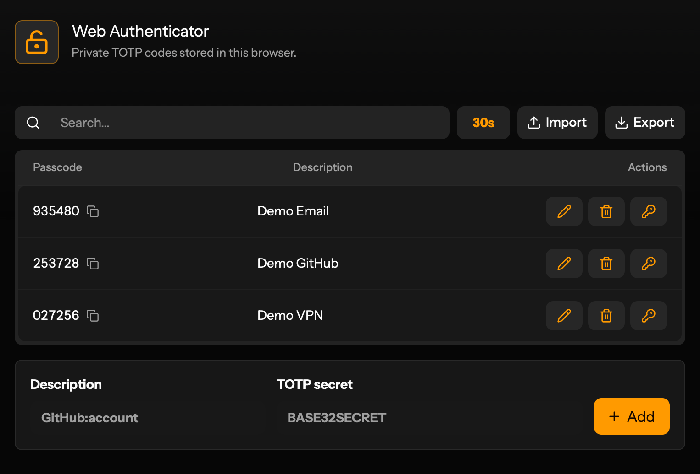

# Web Authenticator

> A private browser-based TOTP authenticator

<p align="center">
  
</p>
<p align="center">
  <em>Web Authenticator running locally with three demo TOTP records.</em>
</p>

The app stores TOTP secrets in the current browser's IndexedDB database, generates six-digit passcodes locally, and can be installed as a PWA. It does not send records to a backend.

## Features

- Add TOTP records with a description and Base32 secret.
- Generate and copy current six-digit passcodes.
- Copy stored secrets when needed for backup or migration.
- Search records with fuzzy matching against descriptions.
- Edit record descriptions.
- Delete records from local browser storage.
- Import and export records as `otpauth://totp/...?...` text files.
- Installable PWA with a service worker and app manifest.

## Requirements

- Bun
- A Chromium-compatible browser for Playwright e2e tests

Install dependencies:

```sh
bun install
```

## Development

Start the local development server:

```sh
bun run dev
```

The app runs on `http://localhost:3000` by default. Set `PORT` to use another port:

```sh
PORT=3001 bun run dev
```

The dev script builds Tailwind output first, then starts `index.ts` with Bun hot reload.

## Scripts

```sh
bun run css:build
bun run dev
bun run start
bun run build
bun run e2e
```

- `css:build` compiles `src/styles.source.css` to `src/styles.css`.
- `dev` builds CSS and runs the Bun server with hot reload.
- `start` builds CSS and runs the Bun server without hot reload.
- `build` writes the static production bundle and PWA assets to `dist/`.
- `e2e` runs the Playwright suite in `e2e/`.

## Import And Export Format

Import accepts plain text files with one `otpauth://totp/` URL per line:

```text
otpauth://totp/GitHub:account?secret=BASE32SECRET&issuer=GitHub
```

During import, invalid lines and invalid TOTP secrets are skipped. Existing records are matched by normalized secret; matching records are updated with the imported description.

Export downloads `totp-secrets.txt` with the same one-line-per-record format.

## Local Data

Records are stored in IndexedDB:

- Database: `web-authenticator`
- Object store: `totp-records`
- Unique index: `secret`

Secrets are kept in browser storage as app data. Treat exported files and browser profiles containing this app's IndexedDB data as sensitive.

## Testing

Run e2e tests:

```sh
bun run e2e
```

Playwright starts the app at `http://localhost:3000` using the configured web server. The e2e suite clears the app IndexedDB database before each test.

## Project Structure

```text
.
|-- e2e/                  Playwright e2e tests
|-- icons/                PWA icons
|-- src/
|   |-- App.tsx           React UI and interactions
|   |-- main.tsx          React entry point
|   |-- otpauth.ts        Import/export parsing helpers
|   |-- storage.ts        IndexedDB persistence
|   |-- styles.source.css Tailwind source CSS
|   `-- styles.css        Generated CSS
|-- index.html            Bun HTML import entry
|-- index.ts              Bun HTTP server
|-- manifest.webmanifest  PWA manifest
`-- service-worker.js     PWA app-shell cache
```
